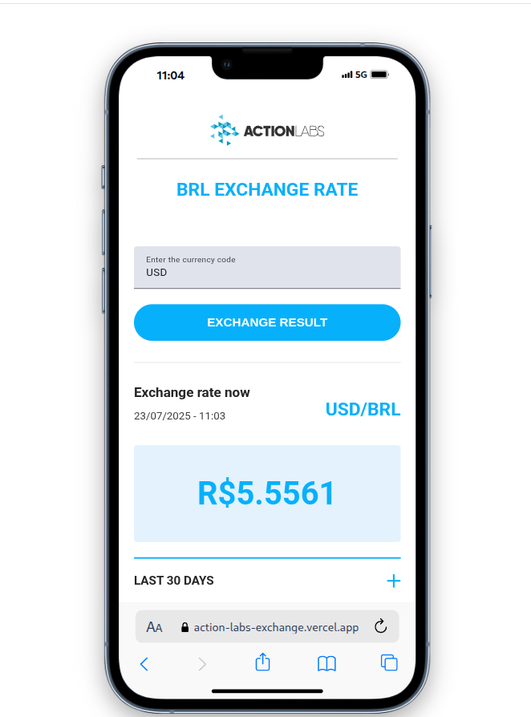

 
  

# BRL Exchange Rate

O **BRL Exchange Rate** é uma aplicação para consulta de cotações de moedas em relação ao Real (BRL), utilizando uma API externa para obter os dados. Este projeto foi desenvolvido como um teste técnico.

## Resultado ✨

- **Você pode conferir a aplicação facilmente no seguinte link:**
  - **[VERCEL](https://action-labs-exchange.vercel.app/)**



---

## Stack 🚀

**Frontend**

- **Angular (v20)**
- **Angular Material**
- **RxJS**
- **SCSS** 
- **Signals**


## Rodando Localmente ⚡️

Existem duas maneiras de rodar o projeto: **manualmente** ou com **Docker**.


### Manualmente ⚒️

1.  Clone o repositório e instale as dependências:
    ```bash
    git clone https://github.com/dev-araujo/exchange-brl-rate__test.git
    ```

2. Instale as dependências: 
    
    ```bash
    npm install
    ```

3.  Execute o servidor de desenvolvimento:
    ```bash
    ng serve
    ```

⭐ A aplicação estará disponível em `http://localhost:4200`.


### Com Docker  🐋

#### 📋 Pré-requisitos

Certifique-se de que você tem o [Docker](https://www.docker.com/get-started) e o [Docker Compose](https://docs.docker.com/compose/install/) instalados.

1.  Clone o repositório:
    ```bash
    git clone https://github.com/dev-araujo/exchange-brl-rate__test.git
    ```

2.  Execute o Docker Compose para construir a imagem e iniciar o contêiner. O comando abaixo usa a configuração de desenvolvimento:

    ```bash
    docker-compose up -d
    ```
    ou

    ```bash
    docker compose up -d
    ```
   

⭐ A aplicação estará disponível em `http://localhost:4201`. 

---


#### Autor 👷


[Adriano P Araujo](https://www.linkedin.com/in/araujocode/)
